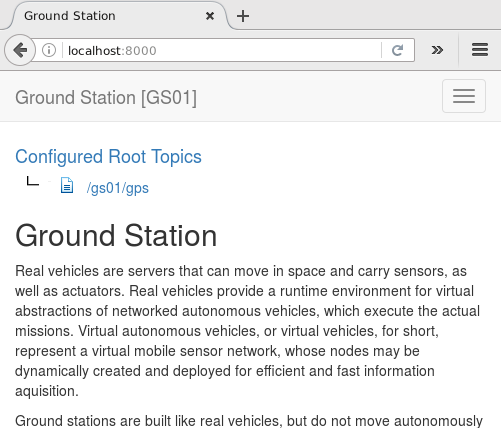

# Cyber-Physical Cloud Computing

## Summary

We present a Platform-as-a-Service (PaaS) system for performing multi-customer information
acquisition missions on unmanned vehicle swarms operated and maintained by a third party. Customers implement their
missions completely unaware of each other and the available vehicle infrastructure. Vehicle swarm providers may add
or remove vehicles unnoticed by customers for maintenance, recharging, and refueling. To achieve this, we apply the
paradigm of cloud computing to virtualized versions of unmanned vehicles. Our implementation allows the simulation
of multi-customer information acquisition missions as well as their execution on real hardware running the robot
operating system (ROS).

Homepage: http://cpcc.cs.sbg.ac.at

## Demo distribution

### Requirements
- Java 11+
- 2 GB RAM for the Ground Station and 1 GB for each Real Vehicle.

### Setup and start
Download the demo distribution from [here](http://cpcc.cs.sbg.ac.at/cpcc-demo-0.0.5-SNAPSHOT-demo.tar.gz) and unpack it, and start the setup script as follows:

	$ tar -xzf cpcc-demo-<version>-demo.tar.gz
	$ cd cpcc-demo-<version>
	$ bin/setup_demo.sh

After the setup succeeded run the demo with:

	$ bin/run.sh

If you do not use 8000 as your base port number, please use your port number in the following link. Now start your favorite browser and go to URL [http://localhost:8000](http://localhost:8000). The browser should present the ground station (GS) start page:

Some virtual vehicle code examples are available in subfolder `examples` of the unpacked demo distribution. 

To upload example code, switch to tab `Virtual Vehicles` in the ground station application and click button `Code Upload`.
Uploading four instances of example code `vv-rnd-150m-by-150m-50-tasks.js` with name prefix `VV` should look like this:

To shutdown the demo run:

	$ bin/shutdown.sh

## Get the code

The easiest way to get started with the code is to [create your own fork](http://help.github.com/forking/)
of this repository, and then clone your fork:

	$ git clone git@github.com:<you>/cpcc.git
	$ cd cpcc
	$ git remote add upstream git://github.com/cksystemsgroup/cpcc.git

At any time, you can pull changes from the upstream and merge them onto your master:

	$ git checkout master               # switches to the 'master' branch
	$ git pull upstream master          # fetches all 'upstream' changes and merges 'upstream/master' onto your 'master' branch
	$ git push origin                   # pushes all the updates to your fork, which should be in-sync with 'upstream'

The general idea is to keep your 'master' branch in-sync with the 'upstream/master'.

## Building cpcc

### Requirements
- Maven 3.x
- Java 8+
- ROS Java Hydra Maven Repository (coming soon)

The following command compiles all the code, installs the JARs into your local Maven repository, and runs all of the unit tests:

	$ mvn clean install

